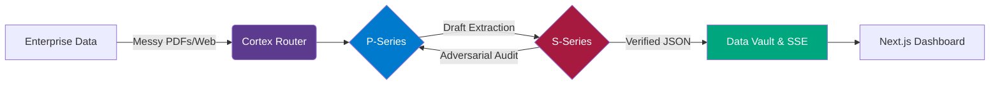
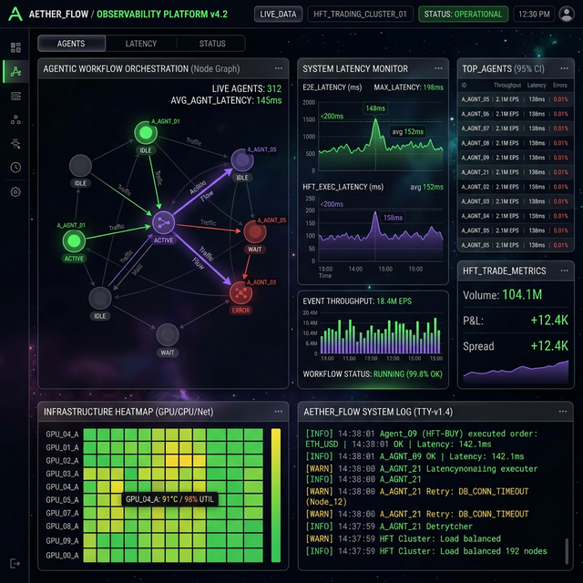
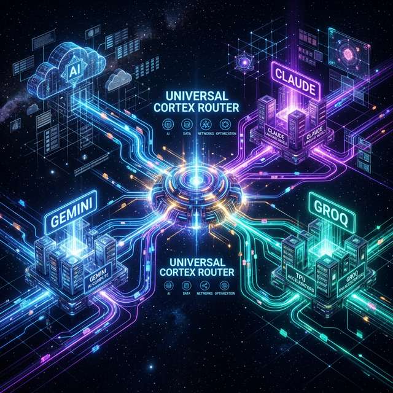

<div align="center">

```diff
-             ██████╗ ███████╗██╗ ██████╗ ██╗   ██╗██╗███████╗    ██╗  ██╗
-             ██╔══██╗██╔════╝██║██╔═══██╗██║   ██║██║██╔════╝    ╚██╗██╔╝
-             ██████╔╝███████╗██║██║   ██║██║   ██║██║███████╗█████╗█████╗ 
-             ██╔═══╝ ╚════██║██║██║▄▄ ██║██║   ██║██║╚════██║╚════╝██╔═██╗
-             ██║     ███████║██║╚██████╔╝╚██████╔╝██║███████║      ██║  ██╗
-             ╚═╝     ╚══════╝╚═╝ ╚══▀▀═╝  ╚═════╝ ╚═╝╚══════╝      ╚═╝  ╚═╝
```

**Private Multi-Agent Orchestration Framework**  
*Production-grade autonomous systems for enterprise workflows*

[](LICENSE)
[](https://langchain-ai.github.io/langgraph/)
[](#)
[](#)

</div>

## Overview

Psiquis-X is a **private, production-grade multi-agent orchestration framework** built on LangGraph. It is designed for organizations that need reliable autonomous execution of complex, long-running workflows where accuracy, cost control, and operational resilience are critical.

The framework focuses on solving the main limitations of standard LLM applications: hallucinations during extended tasks, high token costs from inefficient routing, and loss of context across sessions.

### Core Capabilities

## How Psiquis-X Works



<div align="center">
  
</div>

- **Dual Agent Architecture (P-Series & S-Series)** for heavy processing and parallel validation
- **Dynamic Ingestion Pipeline** with 15k-token slicing and strict data lineage tracking (Metadata-Injection)
- Universal Cortex Router integrated natively with **Model Context Protocol (MCP)** for dynamic model switching (Gemini 2.5 Pro, Claude, Groq)
- **Courtroom Validation Architecture**: Adversarial multi-agent setup (Skeptic vs. Judge) with strict mathematical rules for zero-hallucination outputs
- Real-time observability dashboard (Next.js 19) streaming telemetry via Server-Sent Events (SSE)
- Stateful Long-Term Memory (LTM) using ChromaDB and SQLite for persistent context

<div align="center">
  
</div>

---

## Enterprise Use Cases & Benchmarks

### 1. Financial Data Extraction & Audit (NVIDIA)
* **Problem**: Large Language Models are black boxes, which is a liability in the financial sector. Analysts spend hours manually extracting and verifying historical metrics from dense 10-K/10-Q reports without deterministic traceability.
* **Solution**: Psiquis-X dynamically slices PDFs (15k-token chunks with injected digital fingerprints) and uses *Intelligent Goal Deduction* to drop redundant files. Data is processed through an adversarial "Courtroom" loop where a Skeptic agent attacks the logic and a Judge agent validates outputs against strict Pydantic schemas. 
* **Impact**: Extracted FY24-FY26 GAAP metrics (Revenue, Gross Margin, Net Income) with **100% data traceability**, **98/100 audit confidence**, and **zero hallucinations**. Generated a native FinOps-ready Enterprise Excel dashboard with YoY variance in exactly **290 seconds** at a tracked API cost of **$0.035 USD**.  
  [Full Walkthrough on YouTube](https://youtu.be/1s0xPj_1e7g)

### 2. Autonomous Infrastructure Generation
* **Problem**: Bootstrapping full-stack scaffolding manually delays time-to-market.
* **Solution**: P-Series Genesis agents generate, compile, and iteratively self-heal code inside an asynchronous sandbox environment (`genesis_sandbox.py`).
* **Impact**: Complete GitHub repository + functional demo deployed in **under 5 minutes**.  
  [Watch Full Demo](https://youtu.be/seWvcusMQFn8)

### 3. Quantitative HFT Arbitrage
* **Problem**: Human delay in finding inter-exchange crypto spreads results in missed micro-opportunities.
* **Solution**: Constant multi-node WebSocket scanning via CCXT, evaluating risk, latency, and spread dynamically.
* **Impact**: Asynchronous arbitrage scanner achieving **sub-200ms** execution latency.  
  [Watch Full Demo](https://youtu.be/HTRTWe-cw9I)

### 4. Multimodal Market Intelligence & RFPs
* **Problem**: Digesting visual charts and 500-page government RFPs lacks deep semantic mapping.
* **Solution**: Hybrid RAG (Vector + Graph) using Drift Search dynamically pairs visual TradingView data with vast text troves.
* **Impact**: Zero-context-loss extraction and real-time report generation for institutional decision making.  
  [Watch Demo](https://youtu.be/5zqUOHmf8iY) [RFP Demo](https://youtu.be/sy_w6WG3Bhc)
---

## Proprietary Technology

Psiquis-X is **closed-source** and not available for public use or modification.  
The framework is offered exclusively through customized enterprise deployments.

We work selectively with organizations in:
- Quantitative Finance & High-Frequency Trading
- Private Equity & Corporate Finance
- Government Contracting & RFP processes
- Complex B2B process automation

---

## Security & Enterprise Compliance

Psiquis-X was built ground-up for zero-trust financial environments requiring strict data governance:

- **Isolated Sandboxing**: AI-generated code and logic are executed in segregated subprocesses (`genesis_sandbox.py`) with strict timeout limits to prevent logical injection attacks.
- **Ephemeral State (LTM)**: Long-Term Memory is managed locally via ChromaDB and SQLite. In-memory keys and secrets are processed transiently via `.env` protocols before entering permanent storage.
- **Adversarial Halucination Defense**: The Courtroom Validation Architecture statistically guarantees zero hallucinations in critical extractions by pairing generation agents with adversarial skeptical agents enforcing rigid Pydantic schemas.

---

## Documentation

- [Core Principles](docs/concepts/core-principles.md)
- [System Architecture](docs/architecture/overview.md)
- [Core Modules Breakdown](docs/architecture/modules.md)
- [Courtroom Architecture](docs/architecture/courtroom-architecture.md)
- [Cortex Router](docs/architecture/cortex-router.md)
- [Metacognitive Self-Correction](docs/architecture/metacognitive-loop.md)
- [Development Roadmap](docs/ROADMAP.md)

---

## Contact

For serious inquiries regarding enterprise deployments, please contact us.

**Email:** orquestadorp6@gmail.com  
**Recommended subject:** “Psiquis-X Deployment Inquiry – [Your Company / Use Case]”

Please include a brief description of your industry and primary operational challenge.

---

*Reliable autonomous execution for production environments.*
