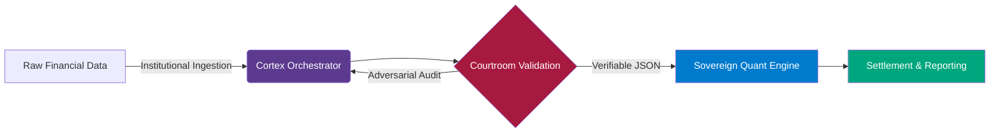

<div align="center">

```text
             ██████╗ ███████╗██╗ ██████╗ ██╗   ██╗██╗███████╗    ██╗  ██╗
             ██╔══██╗██╔════╝██║██╔═══██╗██║   ██║██║██╔════╝    ╚██╗██╔╝
             ██████╔╝███████╗██║██║   ██║██║   ██║██║███████╗█████╗█████╗ 
             ██╔═══╝ ╚════██║██║██║▄▄ ██║██║   ██║██║╚════██║╚════╝██╔═██╗
             ██║     ███████║██║╚██████╔╝╚██████╔╝██║███████║      ██║  ██╗
             ╚═╝     ╚══════╝╚═╝ ╚══▀▀═╝  ╚═════╝ ╚═╝╚══════╝      ╚═╝  ╚═╝
```

**Psiquis-X: Autonomous Financial Infrastructure**  
*Deterministic multi-agent orchestration for institutional-grade design*

[](#)
[](#)
[](#)

</div>

> [!NOTE]
> **Project Status**: Psiquis-X is currently in **Early Access / Active R&D**. We are focusing on protocol-level stability and deterministic validation layers. While the architecture is engineered for institutional compliance, it is currently intended for research, evaluation, and pilot implementations.

## 🌐 The Infrastructure Thesis
As autonomous AI agents begin to govern high-stakes financial operations, the transition from "Black Box" models to deterministic, auditable infrastructure is no longer optional—it is mandatory. Psiquis-X provides the trust layer required for autonomous finance, bridging the gap between LLM reasoning and institutional compliance through **protocol-level governance**.

## 🏗️ Technical Architecture
Psiquis-X is an **enterprise-ready orchestration framework** designed for high-fidelity reasoning and operational resilience. It replaces "probabilistic guessing" with a structured, adversarial validation protocol.



### 🧠 Core Components
- **Cortex Orchestrator**: The high-speed routing and reasoning layer. It manages multi-model deliberation (Vertex, Groq, local RAG) to establish initial context.
- **Courtroom Validation Architecture**: An adversarial multi-agent protocol (Skeptic vs. Judge) designed to minimize hallucinations through strict cross-examination.
- **Sovereign Quant Engine**: The execution layer for autonomous hedge fund operations, utilizing cryptographically verifiable state proofs (Merkle-Trees).

---

## 🚀 Technical Validations & Benchmarks
These demos represent core functional milestones in our research, proving the viability of our deterministic protocol.

### 1. High-Fidelity Financial Audit (NVIDIA Case Study)
* **Problem**: Lack of verifiable traceability in autonomous financial extraction.
* **Solution**: Cortex-driven extraction with **Courtroom Validation** for cross-referencing.
* **Impact**: Extraction of GAAP metrics with cryptographically verifiable lineage and a **98/100 Adversarial Consensus Score** (Judge vs. Skeptic agreement).
* **Demo**: [Full Walkthrough on YouTube](https://youtu.be/1s0xPj_1e7g)

### 2. Autonomous Infrastructure Scaffolding
* **Problem**: LLM-generated code reliability in full-stack environments.
* **Solution**: **Cortex** agents execute, compile, and self-heal code within isolated sandboxes.
* **Impact**: Rapid deployment of self-healing repositories, validated through internal compile-pass benchmarks.
* **Demo**: [Watch AI-Genesis Demo](https://youtu.be/seWvcusMQFn8)

### 3. Quantitative HFT & Arbitrage (Simulation)
* **Problem**: Human latency in detecting high-speed market spreads.
* **Solution**: Sub-200ms WebSocket scanning via **Cortex Orchestrator** and CCXT protocol.
* **Impact**: Validated sub-second automated spread capture with dynamic risk-aware execution.
* **Demo**: [Watch HFT Scanner Demo](https://youtu.be/HTRTWe-cw9I)

### 4. Multimodal Market Intelligence
* **Problem**: Digesting high-density institutional RFPs and financial charts.
* **Solution**: Hybrid RAG architecture pairing visual data processing with vast textual troves.
* **Demo**: [Market Intel Demo](https://youtu.be/5zqUOHmf8iY) | [RFP Demo](https://youtu.be/sy_w6WG3Bhc)

### 5. Institutional Sovereign Quant Engine
* **Problem**: The "Black Box" liability in automated asset management.
* **Solution**: Merkle-tree based state proofs combined with multi-agent consensus.
* **Impact**: Established a blueprint for **Sovereign Auditability** in autonomous hedge fund operations.
* **Demo**: [Watch Sovereign Quant Engine Demo](https://youtu.be/3b4ATLQGqZs)

---

## 📂 Repository Taxonomy

- `agentes/core/`: **Cortex Engine** - The neural orchestration core for high-fidelity reasoning.
- `agentes/ingestion/`: **Data Ingestion** - Autonomous pipelines for Web, API, and Institutional data vectors.
- `missions/`: **Sovereign Quant** - Modular mission templates for standardized financial workflows.
- `skills/`: **Utility Layer** - Enterprise tools for institutional reporting and data intelligence.

## 🛡️ Security & Institutional Compliance
Psiquis-X is built for high-trust environments:
- **Isolated Sandboxing**: AI-generated logic is executed in segregated environments with strict resource limits.
- **Ephemeral State**: Context is managed locally; secrets are handled transiently via secure `.env` protocols.
- **Auditable Logic**: Every decision path is traceable through the **Courtroom Validation** loop.

---

## 📩 Contact & Inquiry
Psiquis-X is currently available for **customized pilot deployments** and **institutional R&D partnerships** for organizations in Quantitative Finance, Private Equity, and High-Trust Government Contracting.

**Email:** orquestadorp6@gmail.com  
**Recommended subject:** “Psiquis-X R&D Inquiry – [Your Company / Use Case]”

---

## 🎨 Visual Architecture & Logic Flows
Detailed documentation for institutional review:
-[Framework Architecture Guide](agentes/docs/framework/README.md)
---

## 👨‍💻 Founding Authors
Psiquis-X is a collaborative R&D framework authored by:
- **SIXxMENDER** ([GitHub](https://github.com/SIXxMENDER))
- **Bosniack-94** ([GitHub](https://github.com/Bosniack-94))

---

## 🛡️ Intellectual Property & License
**Psiquis-X is a Source-Available Proprietary Framework.** All Rights Reserved (2026).

This repository serves as a professional showcase of advanced agentic design patterns.
- **Source Available**: The source code is public for peer review and institutional evaluation.
- **Restricted Use**: Commercial use, redistribution, or modification without explicit written consent is strictly prohibited.
- **Proprietary IP**: Technical design patterns (Courtroom, Cortex Engine) are the intellectual property of the authors.

For more details, see [**LICENSE**](LICENSE) and [**IP Policy**](docs/IP_POLICY.md).

---
*Professional orchestration for mission-critical autonomous operations.*
