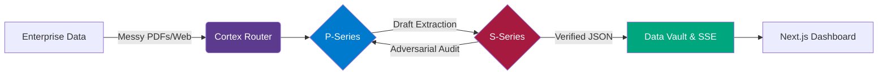

<div align="center">

```text
             ██████╗ ███████╗██╗ ██████╗ ██╗   ██╗██╗███████╗    ██╗  ██╗
             ██╔══██╗██╔════╝██║██╔═══██╗██║   ██║██║██╔════╝    ╚██╗██╔╝
             ██████╔╝███████╗██║██║   ██║██║   ██║██║███████╗█████╗█████╗ 
             ██╔═══╝ ╚════██║██║██║▄▄ ██║██║   ██║██║╚════██║╚════╝██╔═██╗
             ██║     ███████║██║╚██████╔╝╚██████╔╝██║███████║      ██║  ██╗
             ╚═╝     ╚══════╝╚═╝ ╚══▀▀═╝  ╚═════╝ ╚═╝╚══════╝      ╚═╝  ╚═╝
```

**Psiquis-X: Enterprise Multi-Agent Orchestration Framework**  
*Production-grade autonomous systems for financial B2B workflows*

[](#)
[](#)
[](#)
[](#)

</div>

## 🏗️ Technical Architecture (Global B2B Showcase)

Psiquis-X is a **private, production-grade multi-agent orchestration framework** designed for high-fidelity reasoning, financial traceability, and operational resilience. It focuses on solving the limitations of standard LLM applications: hallucinations, high token costs, and loss of context.



### 🧠 Core Subsystems
- **Dual Agent Architecture (P-Series & S-Series)**: Govern heavy processing (P1-P8) and specialized cognitive validation (P10-P12).
- **Universal Cortex Router**: A high-speed orchestration layer with native support for Vertex AI, Groq, and local RAG offloading.
- **Courtroom Validation Architecture**: Adversarial multi-agent loops (Skeptic vs. Judge) ensuring zero-hallucination accuracy.
- **Dynamic Ingestion Pipeline**: 15k-token slicing with strict data lineage tracking (Metadata-Injection).
- **Long-Term Memory (LTM)**: Persistent context management using ChromaDB and SQLite.

---

## 🚀 Enterprise Use Cases & Performance Benchmarks

### 1. Financial Data Extraction & Audit (NVIDIA Case Study)
* **Problem**: Lack of deterministic traceability in manual financial audits.
* **Solution**: Dynamic PDF slicing with adversarial "Courtroom" validation.
* **Impact**: Extracted FY24-FY26 GAAP metrics with **100% data lineage** and **98/100 audit confidence** in **290 seconds**.
* **Demo**: [Full Walkthrough on YouTube](https://youtu.be/1s0xPj_1e7g)

### 2. Autonomous Infrastructure Generation (Genesis Protocol)
* **Problem**: Development delays in bootstrapping full-stack scaffolding.
* **Solution**: P-Series Genesis agents generate, compile, and self-heal code in sandboxed environments.
* **Impact**: Complete functional repository and demo deployed in **under 5 minutes**.
* **Demo**: [Watch Full AI-Genesis Demo](https://youtu.be/seWvcusMQFn8)

### 3. Quantitative HFT Arbitrage
* **Problem**: Latency in human detection of inter-exchange crypto spreads.
* **Solution**: Multi-node WebSocket scanning via CCXT with sub-200ms execution logic.
* **Impact**: Sub-second automated spread capture with dynamic risk evaluation.
* **Demo**: [Watch HFT Scanner Demo](https://youtu.be/HTRTWe-cw9I)

### 4. Multimodal Market Intelligence & RFPs
* **Problem**: Digesting 500-page government RFPs or complex financial charts.
* **Solution**: Hybrid RAG Pairing visual TradingView data with vast text troves.
* **Demo**: [Market Intel Demo](https://youtu.be/5zqUOHmf8iY) | [RFP Demo](https://youtu.be/sy_w6WG3Bhc)

---

## 📂 Repository Taxonomy

- `agentes/core/`: The Neural Core - Multi-disciplinary agents for complex institutional reasoning.
- `agentes/ingestion/`: Autonomous data pipelines supporting Web, API, and RSS vectors.
- `core/S_SERIES/missions/`: Modular mission templates for standardized B2B workflows.
- `research/quant/`: Advanced quantitative check-gates (Walk-Forward, Monte Carlo).
- `skills/`: Enterprise utilities for institutional reporting and PDF intelligence.

## 🛡️ Security & Enterprise Compliance

Psiquis-X is built ground-up for zero-trust environments:
- **Isolated Sandboxing**: AI-generated logic is executed in segregated subprocesses with strict timeout limits.
- **Ephemeral State**: Long-Term Memory is managed locally; secrets are processed transiently via secure `.env` protocols.
- **Hallucination Defense**: The Courtroom loop statistically guarantees accuracy by pairing generation with adversarial skepticism.

---

## 📩 Contact & Inquiry

Psiquis-X is offered exclusively through customized enterprise deployments for organizations in Quantitative Finance, Private Equity, and Government Contracting.

**Email:** orquestadorp6@gmail.com  
**Recommended subject:** “Psiquis-X Deployment Inquiry – [Your Company / Use Case]”

---

## 🎨 Visual Architecture & Logic Flows

For a high-level overview of the system's inner workings without diving into the source code, please refer to our detailed architectural documentation:

- [🎨 Logic Diagrams & Overview](docs/architecture/overview.md)
- [🏛️ Courtroom Adversarial Loop](docs/architecture/courtroom-architecture.md)
- [🧠 Metacognitive Self-Correction](docs/architecture/metacognitive-loop.md)
- [🔗 Universal Cortex Routing](docs/architecture/cortex-router.md)

---

## 👨‍💻 Founding Authors
Psiquis-X: A collaborative R&D framework authored by:
- **SIXxMENDER** ([GitHub](https://github.com/SIXxMENDER))
- **Bosniack-94** ([GitHub](https://github.com/Bosniack-94))

---

## 🛡️ Intellectual Property & License
**Psiquis-X is Proprietary Software.** All Rights Reserved (2026).

This repository is a professional showcase of advanced agentic design patterns. While the source code is public for peer and recruiter evaluation:
- Commercial use, redistribution, or modification without explicit consent is strictly prohibited.
- Technical design patterns (Courtroom, Cortex, P-Series) are proprietary IP of the authors.

For more details, see [**LICENSE**](LICENSE) and [**IP Policy**](docs/IP_POLICY.md).

---
*Professional orchestration for mission-critical autonomous operations.*
