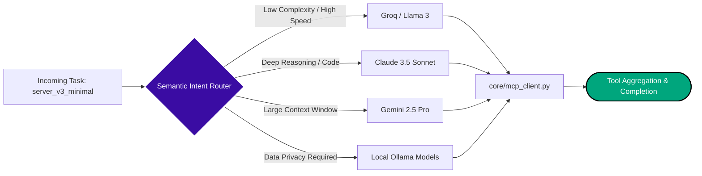

# Universal Cortex Router

The **Universal Cortex Router** is the dynamic routing engine at the heart of Psiquis-X. It intelligently dispatches tasks across a portfolio of local and cloud-based Large Language Models (LLMs) to optimize for **latency, cost, and capability**.

## Routing Logic

Instead of relying on a single frontier model for every component of a workflow, the router analyzes the intent and complexity of the prompt:
- **Simple, repetitive tasks** (like standard text formatting or basic extraction) are routed to local models (via Ollama) or extremely fast APIs (like Groq).
- **Complex reasoning and coding** are routed to frontier models (Anthropic Claude 3.5 Sonnet, Google Gemini 2.5 Pro).

By leveraging local embeddings to classify the task before execution, the Cortex Router drastically reduces token costs while maintaining sub-second latency where it matters most.
