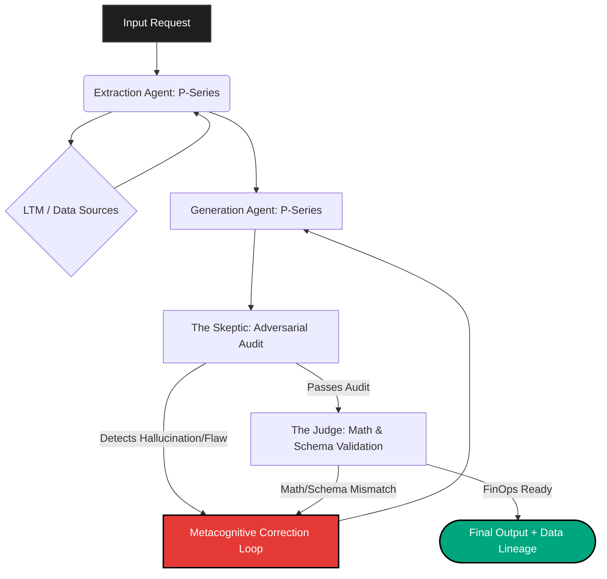

# Courtroom Architecture

The **Courtroom Architecture** is the core adversarial validation pipeline of Psiquis-X. It ensures that the output generated by the primary models is factually accurate, mathematically consistent, and perfectly aligned with the expected schema before it is finalized.

## Pipeline Overview

The architecture operates like a courtroom using a dual-agent structure (P-Series for processing, S-Series for strict validation):

1. **Extraction (The Witness - P-Series):** Specialized agents pull raw context from the Long-Term Memory (LTM) utilizing dynamic 15k-token slicing with Metadata-Injection to preserve Data Lineage.
2. **Generation (The Defense - P-Series):** Standard LLMs produce the initial response, data extraction, or solution.
3. **Audit (The Skeptic Agent - S-Series):** Adversarial agents proactively attack the extracted data, hunting for flaws, hallucinations, or reporting inconsistencies.
4. **Schema Enforcement & Math Validation (The Judge - S-Series):** A deterministic validation layer evaluates the output under strict mathematical rules. If a metric (e.g., Gross Margin YoY) cannot be verified mathematically against the raw extracted text, it is unconditionally rejected.

*This adversarial approach reduces hallucination rates near zero for complex, multi-step enterprise tasks, as demonstrated in our 98% Audit Confidence benchmark on NVIDIA GAAP metrics extraction.*
