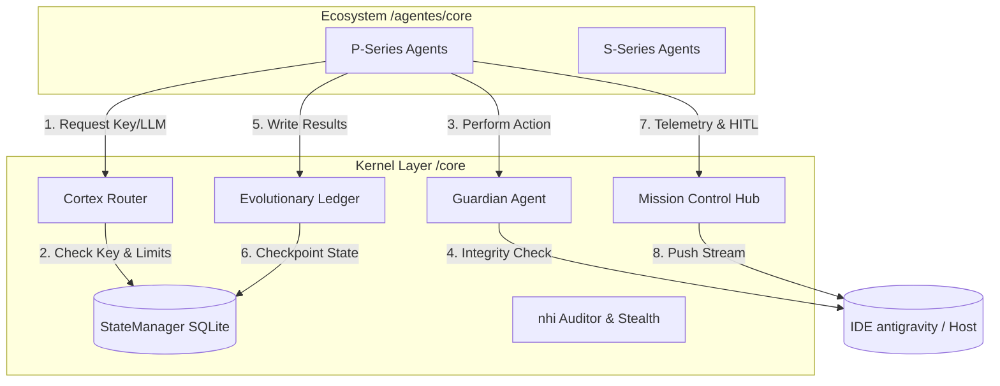
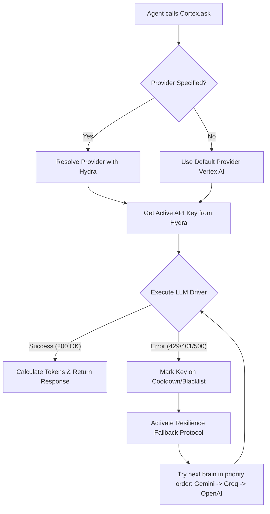
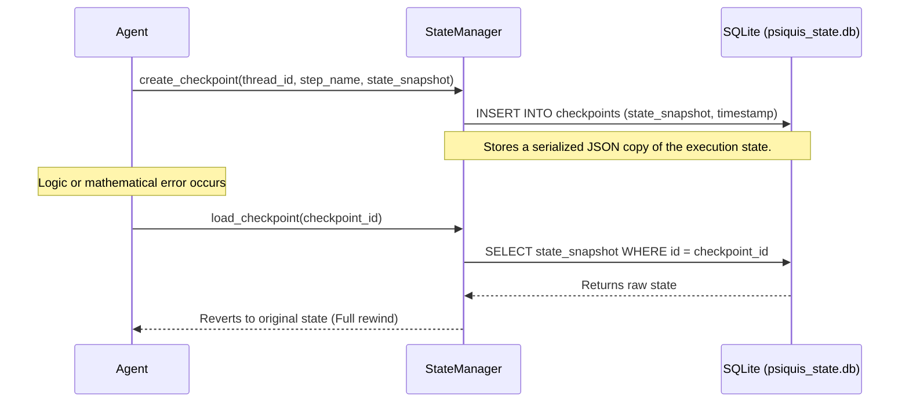
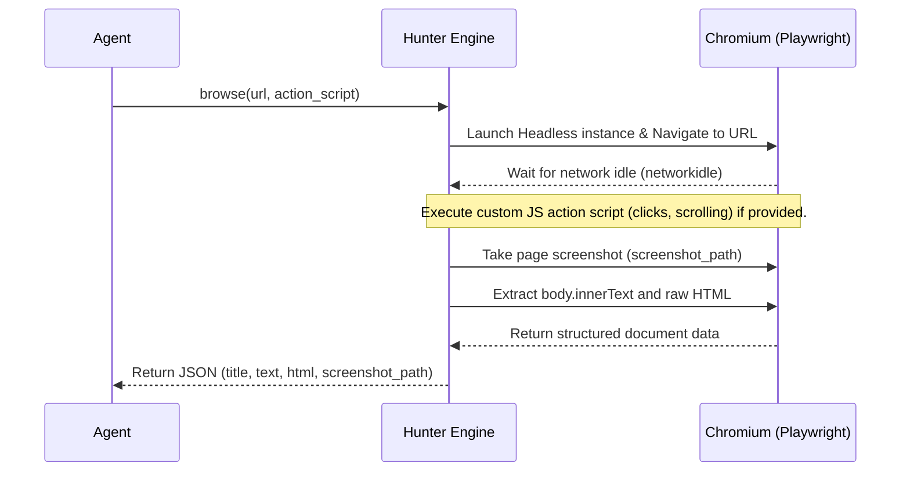
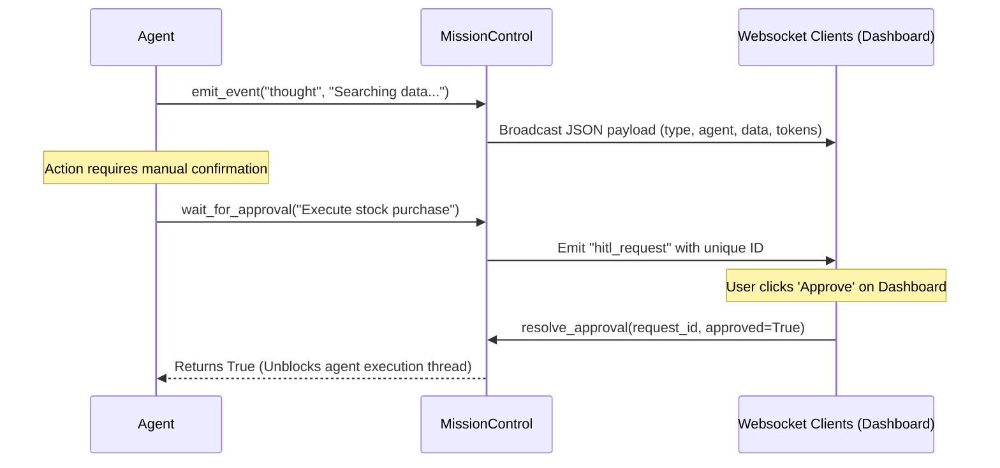
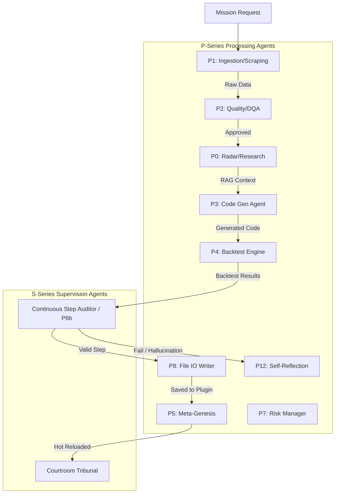
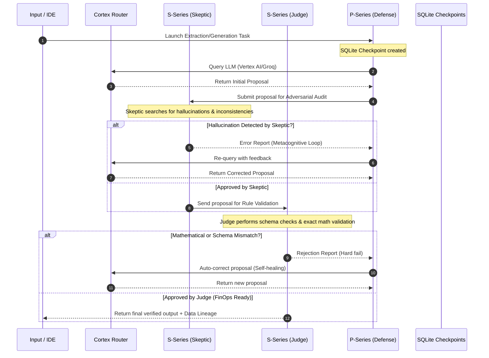

# 🏛️ Psiquis-X: Autonomous Financial Infrastructure
### Deterministic Multi-Agent Orchestration for Institutional-Grade Design

---

## 🏗️ Global System Architecture (IDE antigravity Environment)

This repository contains the codebase for **Psiquis-X**, a deterministic multi-agent infrastructure designed to operate in high-trust financial and development environments. All agent execution, context reading, and operating system level calls occur within the **antigravity IDE** ecosystem, which acts as the supervisor host and execution sandbox.

The architecture is divided into two primary components:
1.  **Control and Kernel Layer (`/core` and `/core/S_SERIES`):** Responsible for model routing, security governance, state graph orchestration, audit logging, and persistence database management.
2.  **Agent Ecosystem (`/agentes/core`):** Specialized autonomous workers (P-Series for processing and S-Series for supervision) that execute quantitative analysis, data ingestion, self-programming, and self-reflection.

---

# SECTION 1: Control & Kernel Layer (`/core`)

The `/core` folder and its subfolder `/core/S_SERIES` represent the backbone and governance system of Psiquis-X.



---

## 1.1 Cortex: Universal Intelligence Router (`/core/S_SERIES/cortex.py`)

### Layer 1: Directory & Context Mapping
*   **Purpose:** Acts as the unified linguistic and cognitive processing intermediary for the framework. Resolves all queries to local LLMs (Ollama) or corporate cloud models (Vertex AI, Groq, OpenAI, Anthropic), abstracting agents from provider-specific drivers.
*   **Dependencies:**
    *   `core.S_SERIES.manager_llaves` (for API key rotation via Hydra).
    *   `agentes.P_SERIES.agente_db_vectorial` (for RAG injection).
    *   `core.S_SERIES.state_manager` (for caching and metadata).
    *   `core.S_SERIES.mission_control` (for telemetry and token accounting).

### Layer 2: Routing & Resilience Flowchart


### Layer 3: Deep Semantic Explanation
*   **Code Logic:** `Cortex` is a Singleton initialized via `__new__`. Upon boot, it verifies which cloud drivers are loaded and initializes the active connections. It exposes a primary `ask` method and its asynchronous version `ask_async`.
*   **Fallback Management:** If an AI provider fails, the exception is captured in a `try/except` block. The resilience method loops through a priority list (`gemini`, `groq`, `openai`, `vertexai`, `anthropic`, `ollama`) and performs fallback calls transparently to the calling agent.
*   **antigravity Interaction:** Vertex AI calls are executed using direct REST requests (via `_ask_vertex` class), bypassing gRPC thread deadlocks under Windows asyncio. Every call estimates token consumption and triggers `mission_manager` to publish metrics to the IDE telemetry stream.

---

## 1.2 StateManager: State Persistence Engine (`/core/S_SERIES/state_manager.py`)

### Layer 1: Directory & Context Mapping
*   **Purpose:** Provides structured persistent storage for global variables, step-by-step mission execution states, checkpoints for backward debugging (Time Travel), and semantic token caching.
*   **Dependencies:**
    *   `sqlite3` (built-in relational database in Python).
    *   Stores data in the local file `data/psiquis_state.db`.

### Layer 2: Persistence & Checkpoint Diagram


### Layer 3: Deep Semantic Explanation
*   **Code Logic:** `StateManager` encapsulates a SQLite database. On initialization, it ensures five critical tables are present:
    1.  `job_state`: Stores results of jobs associated with a thread (`thread_id`).
    2.  `global_metadata`: Stores JSON-serialized global system variables.
    3.  `checkpoints`: Stores snapshots of the global agent graph state to support durable execution.
    4.  `semantic_cache`: Caches LLM responses by calculating the SHA-256 hash of the prompt to mitigate API costs (FinOps).
    5.  `paused_missions`: Allows suspending missions and persisting their variables to disk to be resumed later.
*   **Durable Execution (Time Travel):** The `rewind_to` function deletes all checkpoints created after a given step index and returns the retrieved state from the database, allowing the framework to "time travel" to self-correct failed execution branches.

---

## 1.3 Guardian: Behavior Drift Monitoring (`/core/S_SERIES/guardian.py`)

### Layer 1: Directory & Context Mapping
*   **Purpose:** Enforces Level 4.4 security governance. Acts as a runtime interceptor that evaluates actions proposed by agents before they are dispatched to the operating system or the antigravity IDE.
*   **Dependencies:**
    *   `logging` (for critical alerts).

### Layer 2: Guardian Interception Flow
```mermaid
flowchart TD
    A[Agent proposes Action] --> B{Kill Switch Engaged?}
    B -- Yes --> C[Block Action Unconditionally]
    B -- No --> D[Scan parameters against risk patterns]
    D --> E{Exceeds Drift Threshold?}
    E -- Yes --> F[Log drift details & Block Execution]
    E -- No --> G[Approve Action (Return True)]
```

### Layer 3: Deep Semantic Explanation
*   **Code Logic:** The `GuardianAgent` class maintains a float value (`risk_threshold = 7.0`) and a boolean flag (`kill_switch_engaged`).
*   **Behavioral Drift Detection:** The `verify_safety` function scans for dangerous text patterns (e.g., "transfer all", "disable auditor", "bypass security"). If the cumulative risk score exceeds the threshold, the Guardian blocks the action, logs the attempt, and can trigger `engage_kill_switch` to suspend the entire system lifecycle.

---

## 1.4 Hunter: Browser Navigation & Evidence Ingestion (`/core/S_SERIES/hunter.py`)

### Layer 1: Directory & Context Mapping
*   **Purpose:** Provides a headless browser automation interface that renders JavaScript, extracts text/HTML, and takes evidence screenshots.
*   **Dependencies:**
    *   `playwright.sync_api` (Chromium browser controller library).
    *   Generates screenshots in the root workspace (e.g., `hunter_snapshot.png`).

### Layer 2: Web Ingestion Lifecycle


### Layer 3: Deep Semantic Explanation
*   **Code Logic:** The `browse` method initializes Chromium using Playwright's context manager. It configures a realistic user-agent and mocks browser fingerprints to avoid detection.
*   **Bot Evasion:** Avoids basic anti-bot blocks by adjusting viewport sizes and forcing delays. If navigation fails, the error handler catches the exception, closes the browser session, and returns a structured error object.

---

## 1.5 MissionControl: Command Center & Telemetry (`/core/S_SERIES/mission_control.py`)

### Layer 1: Directory & Context Mapping
*   **Purpose:** Serves as the central communication hub with external systems. Streams OpenTelemetry (OTel) events and acts as the gatekeeper for Human-In-The-Loop (HITL) actions.
*   **Dependencies:**
    *   `core.S_SERIES.state_manager` (to verify historical token counts).
    *   WebSocket interfaces and ASGI server endpoints (FastAPI).

### Layer 2: Telemetry & HITL Diagram


### Layer 3: Deep Semantic Explanation
*   **Code Logic:** `MissionControl` operates as an event hub. The `emit_event` method broadcasts real-time JSON payloads to open WebSocket connections. It keeps track of token consumption and updates the persistence DB. If estimated API costs exceed the configured `budget_limit`, it broadcasts a critical `budget_alert` event.
*   **HITL Mechanism:** The `wait_for_approval` function generates a unique request ID, creates an `asyncio.Event` in an internal dictionary, and suspends execution using `await event.wait()`, blocking the agent thread until an API call resolves the approval.

---

# SECTION 2: The Agent Ecosystem (`/agentes/core`)

The `/agentes/core` directory contains the logic implementations for the financial and automation agents. The system operates primarily with processing agents (**P-Series**) and continuous validators (**S-Series**).



---

## 2.1 Agent P0: Deep Investigation & Radar (`agente_p0.py`)
*   **Purpose:** Conducts real-time web research.
*   **System Prompt:** "Senior Researcher Psiquis-X" / "ROLE: DATA ANALYST (SYSTEM 2)". Instructs the model to avoid conversational small talk, report network connection failures as "CRITICAL", and forbids inventing financial prices or trends when real-time data is missing.
*   **Tools:** `_search_web_radar` (DuckDuckGo Search tool) and integration with Cortex drivers.
*   **Execution:** Asynchronous.
*   **Semantic Flow:** Receives a query, executes a stateless search via `_search_web_radar`, parses the results, and synthesizes a structured Markdown report for consumption by downstream agents.

---

## 2.2 Agent P1: Data Ingestion Facade (`agente_p1_ingesta.py`)
*   **Purpose:** Centralized entry point and routing logic for web scraping and APIs.
*   **Tools:** `agente_web_scraper`, `agente_financial_api`, `agente_rss_reader` and `code_first_process`.
*   **Execution:** Asynchronous (Facade).
*   **Semantic Flow:** Checks inputs. If financial data variables are found (`ticker`, `symbol`, `data_path`), it starts the `code_first_process` code execution pipeline. If standard URLs are found, it triggers the web scraper agent. Returns a unified JSON output.

---

## 2.3 Agent P2: Data Quality Audit - DQA (`agente_p2_dqa.py`)
*   **Purpose:** Audits the structural integrity of input data before passing it to code generation pipelines.
*   **Tools:** `run_risk_audit` skill.
*   **Execution:** Synchronous.
*   **Semantic Flow:** Scans text input for parsing failures, missing schema parameters, or null data types. Returns a success status indicating whether the audit was approved.

---

## 2.4 Agent P3: Code Generation & Copywriting (`agente_p3.py`)
*   **Purpose:** Programmatically builds new agent modules and writes marketing proposals.
*   **System Prompt:**
    *   *Code Mode:* "You are an expert Python developer (P3)..." Disallows placeholders/TODO comments, requiring writing the complete Python module starting from the `templates/base_agent.py` template.
    *   *Copywriting Mode:* "You are a Senior Copywriter and Marketing Strategist..."
*   **Tools:** `run_seo_audit` skill, `sandbox.executor.sandbox` executor, and Cortex RAG retrievals.
*   **Execution:** Asynchronous.
*   **Semantic Flow:** Loads learned lessons from `data/memory/genesis_lessons.json` to prevent past coding errors. Generates Python source code and runs a test execution in the sandbox. If compilation errors are detected, it queries Cortex to rewrite and fix the module before returning it.

---

## 2.5 Agent P4: Quantitative Backtesting Engine (`agente_p4.py`)
*   **Purpose:** Executes quantitative trading backtests and audits frontend React components.
*   **Tools:** `run_react_audit` skill and safe AST Python interpreter (`validate_code_safety`).
*   **Execution:** Synchronous.
*   **Semantic Flow:** If React elements are detected in parameters, routes to the UI auditor. For financial datasets, loads time-series data using `pandas`, runs AST safety checks on the strategy code (blocking imports like `os`, `sys`, `subprocess` or `exec`/`eval` calls), executes the signals generation function inside a local scope, and computes portfolio performance: Sharpe, Sortino, Calmar, Max Drawdown, Win Rate, and equity curves.

---

## 2.6 Agent P5: Meta-Genesis Protocol (`agente_p5_genesis.py`)
*   **Purpose:** Coordinates the autonomous evolution loop: research, generation, verification, and module deployment.
*   **Tools:** Playwright sandbox validations, `dspy_lite` prompt optimizer, and `PluginLoader` hot reload interface.
*   **Execution:** Asynchronous.
*   **Semantic Flow:**
    1.  Calls **P0** to research requirements.
    2.  Calls **P3** to generate Python agent source code.
    3.  Creates a directory under `agentes/generated/` and writes `agent.py`.
    4.  Runs sandbox validation checks. If errors occur, triggers a DSPy-Lite compilation callback to rewrite.
    5.  Appends the new agent metadata to `config/agents.yaml` and hot-reloads it using `PluginLoader.hot_reload()`.

---

## 2.7 Agent P7: Risk Manager - Uroboros (`agente_p7_riesgo.py`)
*   **Purpose:** Audits trading opportunities using instinctual bias filters.
*   **System Prompt:** "ROLE: FINAL JUDGE (TRIBUNAL)". Enforces JSON formatting and applies the strict `SALSA_SECRETA_CONTEXT` context.
*   **Tools:** `metricas_instintivas` limits definitions.
*   **Execution:** Asynchronous.
*   **Semantic Flow:** Audits deals against three instinctual dimensions:
    *   *Greed (Avaricia):* Filters out deals with estimated ROI below threshold limits.
    *   *Laziness (Pereza):* Skips tasks that present high integration or technical friction.
    *   *Envy (Envidia):* Validates skill requirements against the baseline.

---

## 2.8 Agent P8: File IO Writer (`agente_p8.py`)
*   **Purpose:** Securely manages writing newly generated files to disk.
*   **Tools:** Pydantic validators and path verification checks.
*   **Execution:** Asynchronous.
*   **Semantic Flow:** Validates paths to prevent path traversal attacks outside the sandbox directory. If a write is attempted outside the root project scope, it forces writing inside the secure `agentes_en_desarrollo/` fallback directory.

---

## 2.9 Agent P12: Metacognition & Self-Reflection (`agente_p12_metacognicion.py`)
*   **Purpose:** Reflects on logs and report quality to propose autonomous optimizations.
*   **System Prompt:** "SYSTEM META-COGNITION MODULE".
*   **Tools:** Cortex connection.
*   **Execution:** Asynchronous.
*   **Semantic Flow:** Scans the last 200 lines of `startup_log` and recently saved reports. Analyzes bottlenecks, structures a performance critique in Markdown, and saves it to `data/metacognition/reflection_<timestamp>.md`.

---

## 2.10 Agent P6b: S-Series Neural Auditor (`core/S_SERIES/a2a_protocol.py` or embedded)
*   **Purpose:** Evaluates step outcomes and triggers recovery plans for runtime errors.
*   **System Prompt:** "You are P6b, the Supreme Auditor."
*   **Tools:** DSPy-Lite and Synaptic Schema 2.0.
*   **Execution:** Asynchronous.
*   **Semantic Flow:**
    *   *Error Recovery:* Analyzes runtime traceback messages and generates a `SRIP` (System Recovery Intervention Plan) instructing the orchestrator whether to retry, swap keys, or await human input.
    *   *Step Auditing:* Reviews outputs against the emotional spectrum (Ira = crash, Avaricia/Pereza = low quality). Uses Synaptic Schema to compress global variables, reducing token size before calling the audit LLM. Instructs to `CONTINUE`, `OPTIMIZE` or trigger `HUMAN_INTERVENTION`.

---

# SECTION 3: System Mechanics & Critical Cycles



### 3.1 Persistence & Time Travel (Durable Execution)
The engine preserves states in long-running jobs using checkpoints. If an intermediate step fails or a model output is rejected by the S-Series Judge, the `EvolutionaryLedger` rewinds the execution graph state. It queries SQLite to fetch the state snapshot from the last approved checkpoint, restoring local memory states and restarting execution with corrected parameters without re-running early stages of the pipeline.

### 3.2 Message Passing & Communication
Agents communicate using structured inputs/outputs validated by Pydantic:
- Graph steps update a central `estado_global` dictionary managed by the core loop.
- Agents invoke one another using `execute(**kwargs)`.
- Validated types like `SRIP` (System Recovery), `ResearchOutput` or `CodeGenOutput` ensure agent boundaries line up with expected schemas.

### 3.3 Financial Resource Optimization (FinOps)
- **Key Rotation (Hydra):** The key manager monitors Calls Per Minute (CPM) for API keys. If a key hits a 429 error, it is placed on a 60-second cooldown. Expired or 401 keys are immediately blacklisted.
- **Synaptic Schema 2.0:** The P6b step auditor replaces large global state variables with lightweight JSON summaries, reducing context sizes by up to 80% before querying evaluation LLMs.
- **Semantic Cache:** Repetitive translation or classification queries are cached in SQLite's `semantic_cache` table to avoid redundant token generation costs.

---

*Psiquis-X executes as a highly auditable, robust, and fault-tolerant agent framework inside the antigravity IDE environment.*
