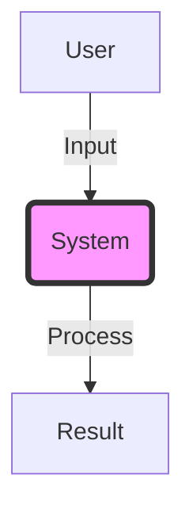

# 🐙 [Mission/Project Name]: Delivery Report

## Status: [MISSION ACCOMPLISHED 🚀 / IN PROGRESS 🚧 / HALTED 🛑]

### 1. [Main Objective Name] ✅
**Objective**: [Brief description of what was set out to be achieved]
- **Result**: [Specific outcome achieved]
- **Key Technology**: [Libraries, modules, or techniques used]
- **Status**: [Production Ready / Testing / Prototype]

### 2. [Secondary Objective Name] ✅
**Objective**: ...
- **Details**: ...

---

## Evidence and Metrics 🕵️‍♂️

> [!TIP]
> Attach screenshots, logs, or key metrics here.

**Validation Checklist**:
- [x] Success Criterion 1
- [x] Success Criterion 2
- [x] Success Criterion 3

---

## System Architecture

---

## Next Steps (Post-Delivery)
1. [Immediate action]
2. [Future improvement]
3. [Maintenance]

---
*Generated by AI Engine - Octopus Prime Standard* 🐙
