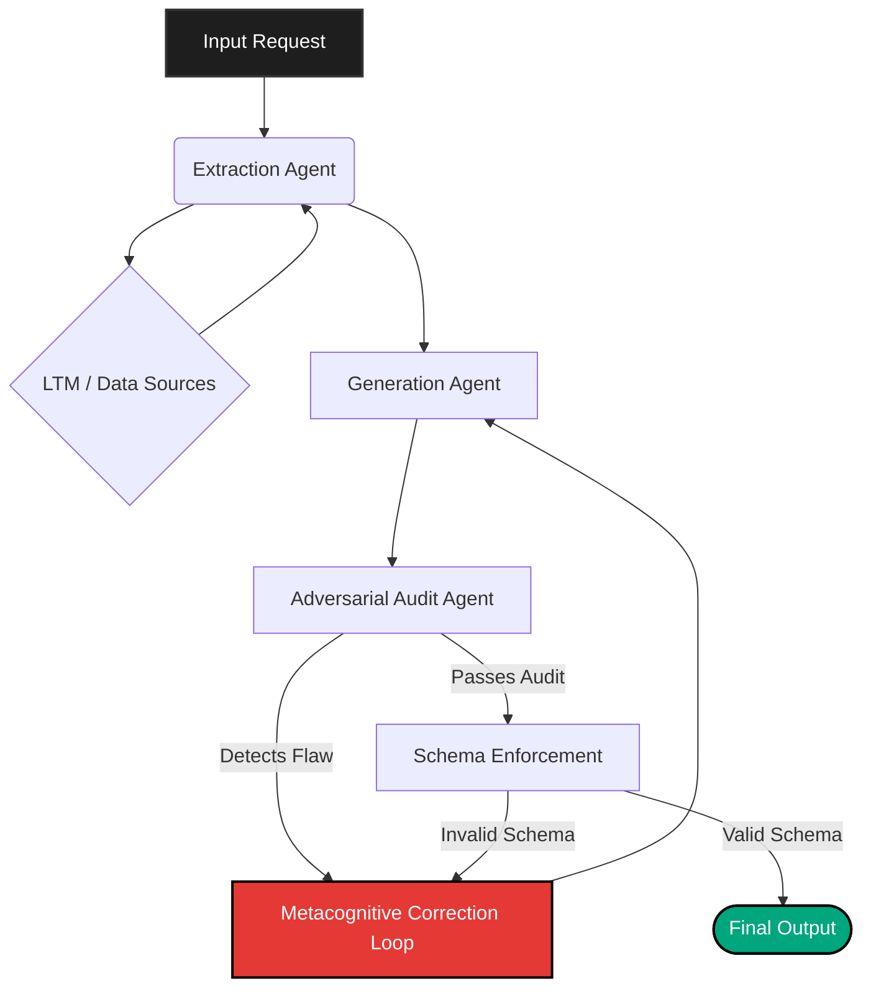

# Courtroom Architecture

The **Courtroom Architecture** is the core adversarial validation pipeline of Psiquis-X. It ensures that the output generated by the primary models is factually accurate, mathematically consistent, and perfectly aligned with the expected schema before it is finalized.

## Pipeline Overview

The architecture operates like a courtroom:
1. **Extraction (The Witness):** specialized agents pull raw context from the Long-Term Memory (LTM) and external sources.
2. **Generation (The Defense):** standard LLMs produce the initial response or solution.
3. **Audit (The Prosecution):** adversarial agents proactively try to find flaws, hallucinations, or inconsistencies in the generated response.
4. **Schema Enforcement (The Judge):** a deterministic validation layer ensures the final output strictly adheres to the requested data structure (e.g., JSON schema for API endpoints).

*This adversarial approach reduces hallucination rates near zero for complex, multi-step enterprise tasks.*
