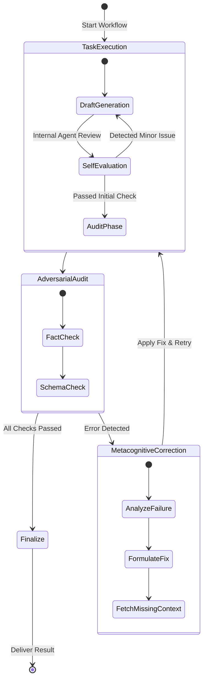

# Metacognitive Self-Correction Loop

The **Metacognitive Self-Correction Loop** is an autonomous error-handling and hallucination-detection mechanism built into the LangGraph orchestration layer of Psiquis-X.

## How It Works

Unlike standard LLM systems that fail silently or produce confident hallucinations, Psiquis-X monitors its own execution path in real time. If an agent detects a structural error, a logic flaw, or missing context during the *Courtroom Audit* phase, the loop automatically triggers a targeted re-evaluation.

This self-healing capability allows long-running autonomous processes to recover from intermediate failures without requiring human intervention, ensuring high reliability for enterprise deployments.
