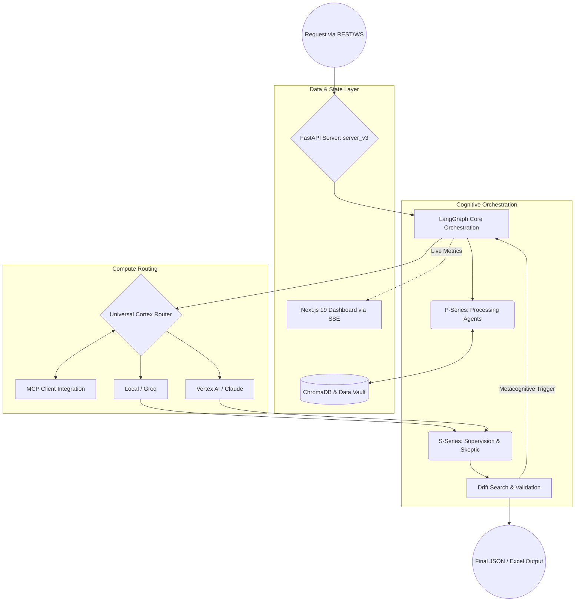

# System Architecture

Psiquis-X is a multi-layered orchestration framework designed for deterministic execution in complex enterprise environments.

The architecture consists of three main layers:

## 1. Data & State Layer
- **Stateful Long-Term Memory (LTM)**: Persistent context maintained through the `StateManager` using ChromaDB and local Data Vaults.
- **Real-time Telemetry (FastAPI & SSE)**: A lightweight, asynchronous FastAPI server (`server_v3_minimal`) streams execution metrics, token usage, and live agent thoughts via Server-Sent Events (SSE) to a Next.js 19 observability dashboard.

## 2. Compute Routing Layer – Universal Cortex Router
- Dynamic routing engine integrated natively with the **Model Context Protocol (MCP)** via dedicated `mcp_client` infrastructure.
- Intelligently switches between Vertex AI (Gemini), Groq, Anthropic (Claude), OpenAI, and local Ollama deployments based on task requirements, latency needs, and cost.
- **Semantic Intent Routing**: Uses local embeddings to classify incoming requests and avoid dispatching simple extraction tasks to expensive frontier models.

## 3. Cognitive Orchestration Layer
- Built on LangGraph `core/orchestration` for deterministic, graph-based multi-agent state management.
- **P-Series Agents (Processing & Ingestion)**: Heavy-duty autonomous workers running in isolated sandbox environments (`genesis_sandbox`), responsible for ingestion, strategy, and execution.
- **S-Series Agents (Supervision & Skepticism)**: Lightweight, parallel agents executing adversarial validation (`drift_search` and `hunter` modules) without blocking the main event loop.
- **Courtroom Validation Pipeline**: Adversarial setup where S-Series agents actively seek structural flaws in P-Series outputs before generating the final Data Lineage output.
- **Metacognitive Self-Correction Loop**: Runtime monitoring that automatically catches logic drifts and triggers autonomous repairs.

**Deployment Model**: Psiquis-X is deployed as a self-contained system in the client’s environment or dedicated infrastructure. It is not offered as a shared SaaS platform.

## High-Level Architecture Flow

