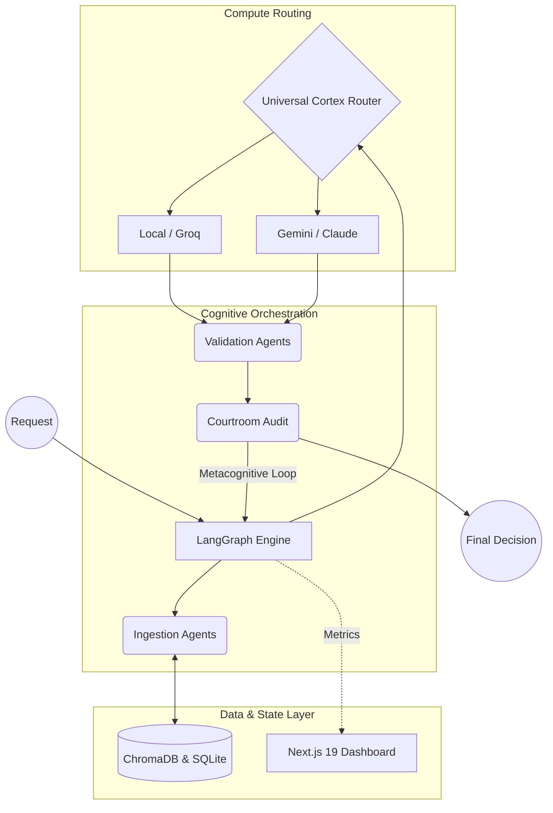

# System Architecture

Psiquis-X is a multi-layered orchestration framework designed for deterministic execution in complex enterprise environments.

The architecture consists of three main layers:

## 1. Data & State Layer
- **Stateful Long-Term Memory (LTM)**: Persistent context and agent identity maintained with ChromaDB (vector store) and SQLite (operational ledgers).
- **Real-time Telemetry**: Execution metrics, token usage and latency are streamed via Server-Sent Events (SSE) to a Next.js 19 observability dashboard.

## 2. Compute Routing Layer – Universal Cortex Router
- Dynamic routing engine that selects the optimal LLM provider based on task requirements, latency needs and cost.
- Supports Vertex AI (Gemini), Groq, Anthropic (Claude), OpenAI and local models via Ollama.
- **Semantic Routing**: Uses local embeddings to classify intent and avoid sending simple tasks to expensive frontier models.

## 3. Cognitive Orchestration Layer
- Built on LangGraph for graph-based multi-agent workflows.
- **P-Series Agents**: Modular specialized agents for ingestion, validation, strategy, risk assessment and execution.
- **Courtroom Architecture**: Adversarial validation pipeline (extraction → audit → schema enforcement → generation) to ensure factual and mathematical consistency.
- **Metacognitive Self-Correction Loop**: Runtime monitoring that automatically detects errors or hallucinations and triggers corrective actions without human intervention.

**Deployment Model**: Psiquis-X is deployed as a self-contained system in the client’s environment or dedicated infrastructure. It is not offered as a shared SaaS platform.

## High-Level Architecture Flow

