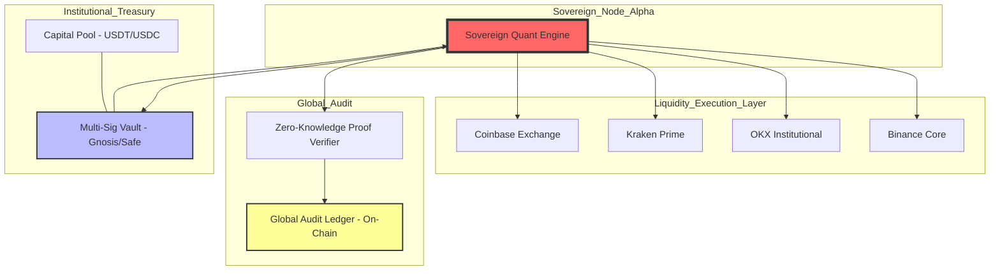

# 🌐 GLOBAL SOVEREIGN NETWORK
## Phase 2: Multi-Exchange Deployment & Institutional Scaling

This map represents the macro vision of the system. The node we just validated is a single execution unit within a distributed financial intelligence network.

### 🛰️ Protocol Scalability
1.  **Multi-Exchange Synchronization:** The Rust engine is capable of managing parallel WebSockets for multiple exchanges simultaneously.
2.  **ZK-Audit:** Local Merkle proofs can be verified via Zero-Knowledge Proofs on a public network without revealing the exact strategy.
3.  **Autonomous Allocation:** The system is designed to dynamically request capital from the Treasury based on the CIO's confidence levels.
