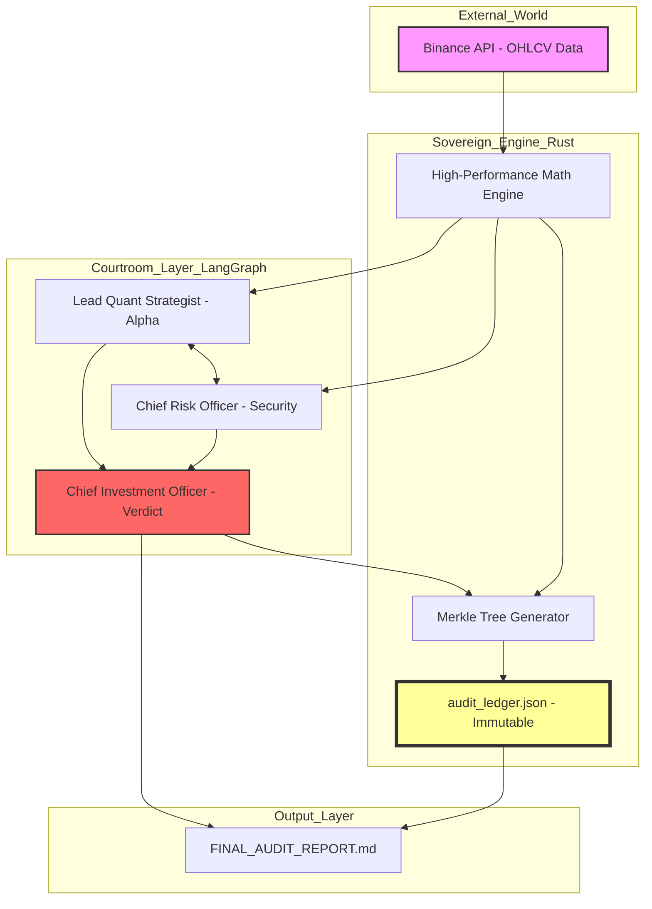

# 🏛️ SOVEREIGN QUANT: ARCHITECTURE MAP
## High-Frequency Verifiable Intelligence

This map represents the sovereignty flow of the system. It is not a simple script; it is a cryptographic chain of custody for financial truth.

### 🔐 Integrity Protocol
*   **Rust Sovereign Layer:** Deterministic calculations protected against memory manipulation.
*   **Adversarial Consensus:** No strategy is approved without cross-scrutiny.
*   **Merkle Evidence:** Each block contains a Merkle root linking raw data to the final AI decision.
